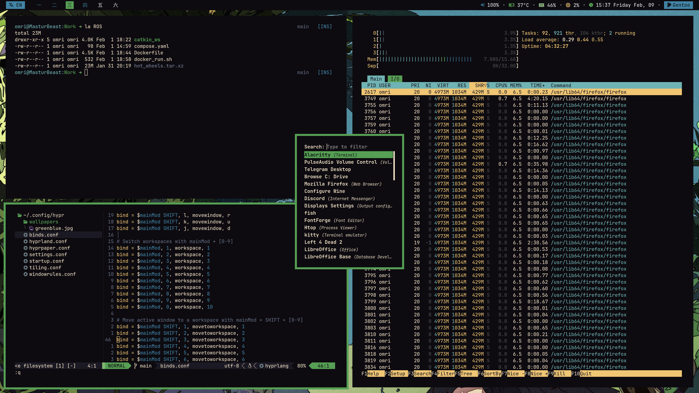

# My main dots

## Overview
My dots for Gentoo PC setup. A good half is shamelessly stolen from [phuocn0302](https://github.com/phuocn0302/dotfiles). Kudos to open source!

# What's inside?
This repo includes dots for:
- [x] alacritty
- [x] hyprland
- [x] ~~anime wallpaper~~
- [x] hyprpaper
- [x] waybar
- [x] rofi
- [x] zsh

## Screenshots

## Task list
- [ ] Better color management
- [ ] Learn how to exit vim

## Wallpaper
Check out [source](https://www.pixiv.net/en/artworks/59810770) on pixiv.
